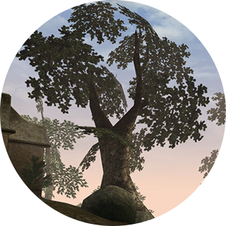

`EN` [`RU`](README.ru.md)

# Morrowind Screenshots



Original screenshots and videos from The Elder Scrolls III: Morrowind. No third-party mods. No color filters. No
interface.

- [Site](https://mwscr.dehero.site)
- [Instagram](https://instagram.com/mwscr/)
- [VK](https://vk.com/mwscr)
- [Telegram](https://t.me/mwscr)
- [YouTube](https://www.youtube.com/@mwscr)
- [GitHub](https://github.com/dehero/mwscr)

## About the project

The goal of the project is to seek out the hidden beauty and celebrate the visual aesthetics of Morrowind, a computer
game from [Bethesda Softworks](https://elderscrolls.bethesda.net/en/morrowind). Most of the content is created using the
[OpenMW](https://openmw.org/) open source engine. Main materials:

- [Posts](https://mwscr.dehero.site/posts/)
- [Inbox](https://mwscr.dehero.site/inbox/)
- [Trash](https://mwscr.dehero.site/trash/)
- [Users](https://mwscr.dehero.site/users/)

If you want to participate in the project, please read the [contributing guidelines](CONTRIBUTING.md).

### Post types

- `shot` - square screenshot;
- `shot-set` - thematic set of four previously published square screenshots;
- `redrawing` - a drawing based on a previously published screenshot;
- `wallpaper` - rectangular screenshot suitable as desktop wallpaper;
- `wallpaper-v` - vertical screenshot suitable as mobile phone wallpaper;
- `clip` - a square video up to 1 minute long;
- `video` - rectangular video up to 1 hour long.

### Publication

[Inbox items](https://mwscr.dehero.site/inbox/) that have successfully passed [editing](CONTRIBUTING.md#editing) are
placed on the [shortlist](https://mwscr.dehero.site/inbox/?publishable=true), from where they are gradually taken to
create new posts. A new post is selected every day.

The post is published simultaneously on all project accounts that support this type of post. The text of the post
includes:

- title;
- description (if any)
- author (if the author is not the project administrator);
- requester (if the post was made by request);
- tags;
- location (if available).

Previously published posts may be published again, without changes, or as part of a different post type.

## About the repository

### Data

Information about published [`data/posts`](data/posts), proposed [`data/inbox`](data/inbox) and rejected
[`data/trash`](data/trash) posts is stored by year in `YAML` format. The original works, due to their large size, are
represented by links to the `store:` external storage, which only the project administrator has access to. Other files:

- [`data/users.yml`](data/users.yml) - information about project contributors in `YAML` format;
- [`data/locations.yml`](data/locations.yml) - list of game locations in `YAML` format.

### Additional files

The [`assets`](assets) folder contains:

- [`assets/previews`](assets/previews) - previews of all images and videos that have ever hit the storage in `AVIF`
  format;
- [`assets/plugins`](assets/plugins) - set of [auxiliary plugins](CONTRIBUTING.md#auxiliary-plugins) for shooting;
- additional images.

### Scripts

The [`src`](src) folder contains scripts responsible for working with the repository, storage, and project accounts. You
need to install dependencies before running scripts locally:

```bash
npm ci
```

To work with external services and storage when running locally, create an `.env` file in the root of the repository
containing credentials:

```env
INSTAGRAM_ACCESS_TOKEN=

VK_ACCESS_TOKEN=

TELEGRAM_PHONE_NUMBER=
TELEGRAM_SESSION=
TELEGRAM_API_APP_ID=
TELEGRAM_API_APP_HASH=

YOUTUBE_API_KEY=

YANDEX_DISK_STORE_PATH=
YANDEX_DISK_ACCESS_TOKEN=

LOCAL_STORE_PATH=
```

There is a [receiving credentials](CREDENTIALS.md) help document for the project administrator to fill in these
variables. Other contributors are limited in their possibilities when running the project locally.

#### Maintenance

The [`src/local/maintain.ts`](src/local/maintain.ts) script runs every hour on a schedule, or on any change to the
repository in the `main` branch. Manual launch is also possible:

```bash
npm run maintain
```

The sequence of steps is:

1. Create issue templates in [`.github/ISSUE_TEMPLATE`](.github/ISSUE_TEMPLATE) according to the descriptions in
   [`src/local/github-issue-resolvers`](src/local/github-issue-resolvers).
2. Add to [`data/posts`](data/posts) posts manually created in project accounts by the administrator.
3. Import to [`data/inbox`](data/inbox) new files from the `store:/inbox` added manually by the administrator.
4. Delete rejected posts to [`data/trash`](data/trash`), restore posts from the trash to [`data/inbox`](data/inbox`).
5. Get reactions to posts in [`data/posts`](data/posts`) from project accounts.
6. Create a new post in [`data/posts`](data/posts) according to the scenarios described in
   [`src/core/scenarios/posting.ts`](src/core/scenarios/posting.ts).
7. Publish unpublished posts from [`data/posts`](data/posts) to project accounts.
8. Create missing and delete unnecessary previews in [`assets/previews`](assets/previews).

#### Issue processing

The script [`src/local/resolve-github-issue.ts`](src/local/resolve-github-issue.ts) runs on creating or modifying an
Issue in the [Issues](https://github.com/dehero/mwscr/issues) section. Issues are the main tool for the administrator
and other contributors to interact with the project. The use of issues is described in the
[contributing guidelines](CONTRIBUTING.md).

#### Data validation

The [`src/local/validate.ts`](src/local/validate.ts) script checks the integrity of data in the [`data`](data) folder
and `store:` storage. Runs manually:

```bash
npm run validate
```

#### Code validation

```bash
npm run test
```

Runs all scripts in the [`src`](src) folder with a filename ending with `.test.ts` to check if the code is working
correctly.

#### Creating a release

```bash
npm run release
```

Checks if there are any changes in the project from the previous release. If there are, it creates a commit with new
release, incrementing the version in [package.json](package.json) and updating [CHANGELOG](CHANGELOG.md).

## Roadmap

As the project develops, it is planned to implement:

- [ ] support for publishing post types ~~`shot-set`~~, ~~`redrawing`~~, `clip` and `video` to project accounts;
- [x] lists of tags and locations with the number of posts in them;
- [x] adding multiple locations to a single post;
- [ ] ~~`wallpaper`~~, ~~`wallpaper-v`~~ and `video-v` post types;
- [x] support for accessing storage via a local file system;
- [ ] Telegram bot for accepting requests ~~and works~~;
- [ ] monthly releases of the archive with works for the previous month;
- [x] project site for quick search of works by author, location, tags, etc.

## License

- The code is licensed under [MIT](LICENSE-CODE)
- The content is licensed under [CC BY 4.0](LICENSE)

You can use the parts of the project code for any purpose, but you may not copy the project as a whole. Feel free to use
the content of the project for any purpose with the link to the original source and author.
