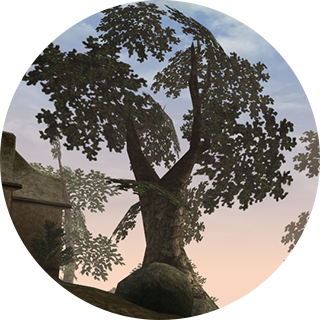

[`EN`](README.md) `RU`

# Morrowind Screenshots



Оригинальные скриншоты и видео из The Elder Scrolls III: Morrowind. Графические и нелорные моды не используются.
Цветовые фильтры не применяются. Элементы интерфейса скрыты.

- [Сайт](https://mwscr.dehero.site)
- [Instagram](https://instagram.com/mwscr/)
- [VK](https://vk.com/mwscr)
- [Telegram](https://t.me/mwscr)
- [YouTube](https://www.youtube.com/@mwscr)
- [GitHub](https://github.com/dehero/mwscr)

## О проекте

Цель проекта - в поиске скрытой красоты и воспевании визуальной эстетики Morrowind, компьютерной игры от компании
[Bethesda Softworks](https://elderscrolls.bethesda.net/en/morrowind). Большинство работ создано с помощью движка
[OpenMW](https://openmw.org/), создаваемого на открытых началах. Основные материалы:

- [Посты](https://mwscr.dehero.site/posts/)
- [Дополнительные материалы](https://mwscr.dehero.site/extras/)
- [Черновики](https://mwscr.dehero.site/drafts/)
- [Отклонённые](https://mwscr.dehero.site/rejects/)
- [Участники](https://mwscr.dehero.site/users/)

Если хотите принять участие в проекте, пожалуйста, прочитайте [руководство для участников](CONTRIBUTING.ru.md).

### Основные типы постов

- [Shot](https://mwscr.dehero.site/help/shot/) - квадратный скриншот;
- [Shot Compilation](https://mwscr.dehero.site/help/shot-set/) - тематическая подборка из четырёх ранее опубликованных
  квадратных скриншотов;
- [Wallpaper](https://mwscr.dehero.site/help/wallpaper/) - прямоугольный скриншот, подходящий в качестве обоев рабочего
  стола;
- [Vertical Wallpaper](https://mwscr.dehero.site/help/wallpaper-v/) - вертикальный скриншот, подходящий в качестве обоев
  мобильного телефона;
- [Клип](https://mwscr.dehero.site/help/clip/) - квадратное видео продолжительностью до 1 минуты;
- [Video](https://mwscr.dehero.site/help/video/) - прямоугольное видео продолжительностью не более 1 часа.

### Дополнительные типы постов

- [News](https://mwscr.dehero.site/help/news/) - новости проекта;
- [Mention](https://mwscr.dehero.site/help/mention/) - упоминание о проекте;
- [Photoshop](https://mwscr.dehero.site/help/photoshop/) - фотомонтаж на основе ранее опубликованного скриншота;
- [Redrawing](https://mwscr.dehero.site/help/redrawing/) - рисунок на основе ранее опубликованного скриншота;
- [Outtakes](https://mwscr.dehero.site/help/outtakes/) - интересные скриншоты, отвергнутые или нарушающие правила
  проекта;
- [Achievement](https://mwscr.dehero.site/help/achievement/) - знаменательное достижение в проекте или в игре.

### Публикация

[Черновики](https://mwscr.dehero.site/drafts/), успешно прошедшие [редактуру](CONTRIBUTING.ru.md#редактура), попадают в
[шорт-лист](https://mwscr.dehero.site/drafts/?publishable=true), откуда постепенно берутся для создания новых постов.
Выбор нового поста происходит ежедневно.

Пост публикуется одновременно во всех аккаунтах проекта, поддерживающих данный тип постов. В текст поста включаются:

- название;
- описание (при наличии);
- автор (если автором не является администратор проекта);
- имя запросившего пост (если пост сделан по запросу);
- теги;
- локация (при наличии).

Ранее опубликованные посты могут публиковаться повторно, без изменений, либо в рамках другого типа постов.

## О репозитории

### Данные

Информация об основных [`data/posts`](data/posts), дополнительных [`data/extras`](data/extras), предлагаемых
[`data/drafts`](data/drafts) и отклонённых [`data/rejects`](data/rejects) постах хранится в разбивке по годам в формате
`YAML`. Оригиналы работ из-за своего большого размера представлены ссылками на внешнее хранилище `store:`, доступ к
которому есть только у администратора проекта. Другие файлы:

- [`data/users.yml`](data/users.yml) - информация об участниках проекта в формате `YAML`;
- [`data/locations.yml`](data/locations.yml) - список игровых локаций в формате `YAML`.

### Дополнительные файлы

В папке [`assets`](assets) хранятся:

- [`assets/previews`](assets/previews) - превью всех изображений и видео, когда-либо попадавших в хранилище в формате
  `AVIF`;
- [`assets/plugins`](assets/plugins) - набор [вспомогательных плагинов](CONTRIBUTING.ru.md#вспомогательные-плагины) для
  съёмки;
- дополнительные изображения.

### Скрипты

В папке [`src`](src) хранятся скрипты, отвечающие за работу с репозиторием, хранилищем и аккаунтами проекта. Для работы
скриптов при локальном запуске нужно предварительно установить зависимости:

```bash
npm ci
```

Для работы с внешними сервисами и хранилищем при локальном запуске, в корне репозитория нужно создать файл `.env` с
учетными данными:

```env
INSTAGRAM_ACCESS_TOKEN=

VK_ACCESS_TOKEN=

TELEGRAM_PHONE_NUMBER=
TELEGRAM_SESSION=
TELEGRAM_API_APP_ID=
TELEGRAM_API_APP_HASH=

YOUTUBE_API_KEY=

YANDEX_DISK_STORE_PATH=
YANDEX_DISK_ACCESS_TOKEN=

LOCAL_STORE_PATH=
```

Для администратора есть [справка по получению учётных данных](CREDENTIALS.md), помогающая заполнить эти переменные. Для
других участников проекта возможности при локальном запуске ограничены.

#### Обслуживание

Скрипт [`src/scripts/maintain.ts`](src/scripts/maintain.ts) запускается каждый час по расписанию, либо при любом
изменении в репозитории в ветке `main`. Возможен также ручной запуск:

```bash
npm run maintain
```

Последовательность шагов:

1. Создать в [`.github/ISSUE_TEMPLATE`](.github/ISSUE_TEMPLATE) шаблоны для заявок согласно описаниям в
   [`src/scripts/github-issue-resolvers`](src/scripts/github-issue-resolvers).
2. Добавить в [`data/posts`](data/posts) посты, созданные в аккаунтах проекта администратором вручную.
3. Импортировать в [`data/drafts`](data/drafts) новые файлы из хранилища `store:/inbox`, добавленные администратором
   вручную.
4. Перенести отклонённые посты из черновиков в [`data/rejects`](data/rejects`), вернуть отклонённые посты в черновики
   [`data/drafts`](data/drafts`).
5. Получить реакции на посты в [`data/posts`](data/posts) и [`data/extras`](data/extras) из аккаунтов проекта.
6. Создать в [`data/posts`](data/posts) или [`data/extras`](data/extras) новый пост согласно сценариям, описанным в
   [`src/core/scenarios/posting.ts`](src/core/scenarios/posting.ts).
7. Опубликовать в аккаунтах проекта не опубликованные посты из [`data/posts`](data/posts) и
   [`data/extras`](data/extras).
8. Создать отсутствующие и удалить ненужные превью в [`assets/previews`](assets/previews).

#### Обработка заявок

Скрипт [`src/scripts/resolve-github-issue.ts`](src/scripts/resolve-github-issue.ts) запускается создании или изменении
зявки в разделе [Issues](https://github.com/dehero/mwscr/issues). Заявки - основной инструмент взаимодействия с проектом
для администратора и других его участников. Использование заявок описано в
[руководстве для участников](CONTRIBUTING.ru.md).

#### Проверка данных

Скрипт [`src/scripts/validate.ts`](src/scripts/validate.ts) проверяет целостность данных в папке [`data`](data) и
хранилище `store:`. Запускается вручную:

```bash
npm run validate
```

#### Проверка кода

```bash
npm run test
```

Запускает все скрипты в папке [`src`](src) с именем файла, заканчивающимся на `.test.ts`, чтобы проверить правильность
работы кода.

#### Создание релиза

```bash
npm run release
```

Проверяет, есть ли в проекте изменения относительно предыдущего релиза. Если есть, создает коммит со следующим релизом,
увеличивая версию в [package.json](package.json) и обновляя [CHANGELOG](CHANGELOG.md).

## Дорожная карта

- [ ] [русская версия сайта проекта](https://github.com/dehero/mwscr/issues/434);
- [ ] [канал проекта в MAX](https://github.com/dehero/mwscr/issues/435);
- [ ] загрузка в черновики Lossy-файлов для постов из раздела `Extras`;
- [ ] варианты соотношения сторон для постов одного типа, объединение `wallpaper` и `wallpaper-v`;
- [ ] редактирование данных проекта только через патчи на сайте;
- [ ] хранение патчей пользователей на сайте с доступом для других пользователей;
- [ ] автопубликация постов типа `clip`;
- [ ] приём запросов на съёмку через Telegram-бот;
- [ ] приём патчей через Telegram-бот;
- [ ] проставление автора в анонимных патчах при их загрузке через GitHub Issues и Telegram-бот;
- [ ] ручное добавление публикаций в пост (подходит для восстановления данных после сбоя и для постов типа `video`);
- [ ] изображения и таблицы в справке на сайте;
- [ ] автосборка руководства для участников проекта из файлов справки в виде единого документа для удобства чтения,
      отказ от дублирующих файлов `CONTRIBUTING.md`;
- [ ] восстановление позиции скролла при возврате к списку постов;
- [ ] быстрое путешествие вперёд-назад по списку постов;
- [ ] слайдшоу из выбранного списка постов;
- [ ] тип постов `comparison` для раздела `extras` с различными сравнениями - например, графики OpenMW и Vanilla;
- [ ] посты типа `poll` для опросов пользователей;
- [ ] возможность в черновике поста отметить, в каком сервисе его не нужно публиковать;
- [ ] тултипы по всему интерфейсу сайта для объяснения значения различных кнопой и других элементов;
- [ ] избавление от ошибки загрузки превью на сайте;
- [ ] конструктор календарей на сайте (выбор собственных изображений для календаря с последующим заказом);
- [ ] подборки из слабых кадров;
- [x] поддержка публикации типов постов `shot-set` и `redrawing`;
- [x] списки тегов и локаций с количеством постов в них;
- [x] добавление нескольких локаций в один пост;
- [x] типы постов `wallpaper`, `wallpaper-v`;
- [x] поддержка доступа к хранилищу `store` через локальную файловую систему;
- [x] Telegram-бот для приёма скриншотов;
- [x] сайт проекта для быстрого поиска постов по автору, локации, тегам и т.п.

## Лицензия

- Код распространяется под лицензией [MIT](LICENSE-CODE)
- Контент распространяется под лицензией [CC BY 4.0](LICENSE)

Вы можете использовать части кода проекта для любых целей, но не копировать проект в целом. Вы свободны использовать
контент проекта для любых целей со ссылкой на первоисточник и автора.
